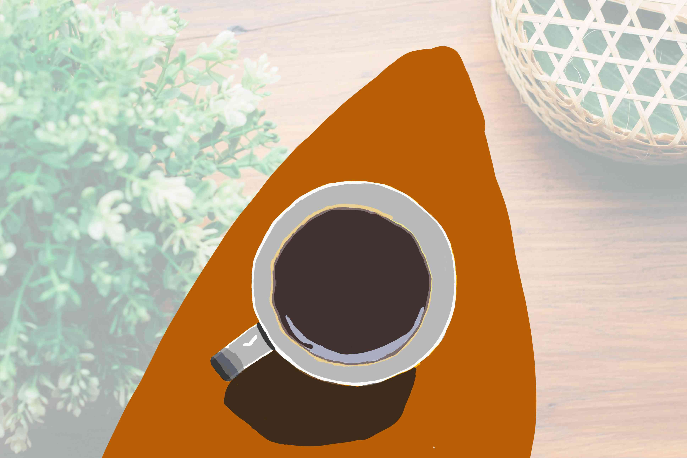

# DAY 1

---

### **🎯 今日主题**  
**《一杯情绪饮料》**  
**训练重点**：色块造型能力 × 光影质感实验 × 抽象情绪转化  

---

### **📝 具体步骤**  
#### **模块1：基础练习（20分钟）**
1. **几何解构挑战**  
   - 找一张饮料照片（咖啡/茶/果汁均可），用 **纯色块+硬边笔刷** 将其分解为5-7个几何图形  
   - 禁用线条，只用套索工具（Lasso Tool）选区填色（如杯身=圆柱体+梯形液体）  
   *✨ 目标：强化形状概括能力，摆脱“线稿依赖症”*

2. **数字图层实验**  
   - 新建「正片叠底」图层，用冷灰色（20%透明度）添加基础投影  
   - 再建「叠加」图层，用亮黄色给杯口添加高光（练习图层混合模式效果）  

---

#### **模块2：创意延伸（40分钟）**  
3. **情绪注入**  
   - 为饮料杯设计一个 **拟人化表情/动态**（如：  
     - 疲惫的咖啡：杯口冒出ZZZ气泡，杯柄变成打瞌睡的眼皮  
     - 愤怒的柠檬茶：吸管扭曲成闪电，冰块炸裂成尖刺）  
   - 用 **自制纹理笔刷** 表现材质（推荐步骤：  
     ① 用Photoshop创建噪点图案 → 导入为颗粒笔刷  
     ② 用涂抹工具制造泼溅感）

4. **背景故事**  
   - 在画面角落添加一个 **微型场景** 暗示饮料的来历（如：  
     - 奶茶杯旁散落加班文档和咬扁的吸管  
     - 蜂蜜柚子茶底部沉淀着撕碎的情书）

---

### 🛠️ **数位板专属技巧**  
- 开启「对称绘图」功能绘制规整杯口，再手动破坏对称性增加生动感  
- 用 **Alt+笔尖** 快速取色，练习精准色彩过渡  
- 尝试用 **笔刷不透明度** 表现液体通透度（30%-70%区间最佳）  

---

### 🌟 **成果延展建议**  
完成后可做以下对比实验：  
1. 复制文件，将整体色调从暖色改为冷色，观察情绪变化  
2. 导出PNG贴到手机桌面，成为专属心情记录

---

怎么也没想到花了我这么久，软件忘了咋用，颜色都是瞎搞的。要求只能用硬笔刷（边缘完全清晰的笔刷），于是阴影部分想做阴影都做不了

只画了第一部分，简单搞了个咖啡杯。重度近视的人还得远离这幅画几米才能看出画的是个杯子