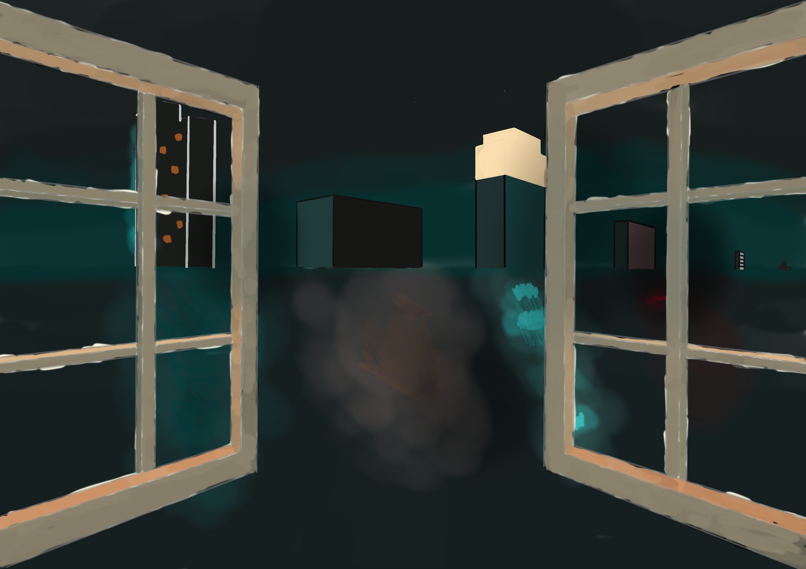

# DAY 2

---

### **🎯 今日主题**  
**《窗外的平行世界》**  
**训练重点**：基础透视 × 场景构图 × 脑洞创意  

---

### **📝 具体步骤**  
#### **模块1：透视基础（30分钟）**
1. **单点透视练习**  
   - 在Krita中开启 **透视网格工具**（View → Assistant Tools → 创建单点透视网格）  
   - 绘制一个带窗框的窗户（重点：窗沿的厚度、玻璃分割线的消失点对齐）  
   *✨ 目标：掌握单点透视中物体向消失点收缩的规律*  

2. **窗外场景实验**  
   - 用硬边笔刷绘制 **3种不同风格** 的窗外景色：  
     - 常规版：城市天际线（几何色块堆叠）  
     - 奇幻版：漂浮岛屿+瀑布（曲线组合）  
     - 科幻版：太空站环形结构（机械线条）  

---

#### **模块2：平行世界构建（50分钟）**  
3. **穿越媒介设计**  
   - 为窗户添加 **维度撕裂** 效果（如：  
     - 窗玻璃裂纹使用 **三角形硬边笔刷** 绘制  
     - 用「叠加」图层添加紫色能量溢出光效）  
   - 在画面一角绘制 **穿越者痕迹**（如：  
     - 窗台上半融化的雪花（科幻世界）  
     - 卡在窗缝的魔法羽毛（奇幻世界）  

4. **光影氛围强化**  
   - 新建「正片叠底」图层添加室内投影（注意光源方向统一）  
   - 用「发光」图层表现窗外世界的特殊光线（如科幻世界的冷蓝光斑）  

---

### **🛠️ Krita专项技巧**  
- **透视辅助**：右键点击画布 → 激活 **「Snap to Assistant」** 让线条自动吸附网格  
- **快速复制**：按住Alt拖动图层可快速复制窗框等重复元素  
- **动态模糊**：用滤镜 → 模糊 → 方向模糊表现高速穿越效果  

---

### **🌟 成果延展建议**  
完成后可尝试：  
1. 用 **色彩平衡调整层**（Ctrl+B）分别调暖室内/冷室外，强化对比  
2. 导出为动画帧：复制文件，微调穿越特效制作简易GIF  

**明日可选主题预告**：  
▸ 《时间胶囊商店》（复古+未来元素融合）  
▸ 《风暴中的宁静》（动态天气+焦点构图）  

---

### **🎨 练习难度分析与调整建议**
这个练习的原始设计确实对纯新手有一定挑战，但通过**拆分步骤+难度调节**完全可以适配你的当前水平！以下是详细分析和调整方案——

---

### **一、难度评估**
#### **原始练习的核心难点**：
1. **透视理解**：单点透视需要掌握消失点对齐逻辑
2. **场景复杂度**：同时处理窗框结构+多风格场景
3. **创意具象化**：将抽象概念转化为视觉符号

#### **适合人群**：
- 理想情况下需要具备：
  - 基础线条控制能力
  - 简单几何体组合经验
  - 图层分离意识

---

### **二、新手友好版改造方案**
#### **▎阶段1：简化透视（20分钟）**
1. **使用参考模板**：
   - 下载现成透视网格图片（搜索 "one point perspective grid png"）
   - 在Krita中导入为底层参考（不透明度调至30%）

2. **基础窗框练习**：
   - 仅绘制 **单扇窗户**（无需窗台/窗帘等细节）
   - 重点练习：
     - 窗框厚度（内外框线平行）
     - 玻璃分割线对齐消失点

#### **▎阶段2：单一场景构建（40分钟）**
3. **窗外场景二选一**：
   - **极简版**：用色块堆砌几何城市（参考我的示意图↓）  
     🏙️ 示例：  
     - 长方形色块作楼体  
     - 三角形作屋顶  
     - 小圆形作窗户灯光
   - **具象版**：绘制你自家窗外的真实景色（可拍照参考）

4. **穿越痕迹简化**：
   - 用现成笔刷添加效果：  
     - Krita自带「粒子」笔刷表现星光  
     - 「水渍」笔刷模拟玻璃反光

---

### **三、分步骤保姆级指导**
#### **步骤1：透视网格设置**
1. 在Krita中新建A4尺寸画布（2480x3508像素）
2. 导入透视网格参考图（文件→打开→调整不透明度）
3. 新建图层，用 **直线工具**（按住Shift）沿网格线绘制窗框

#### **步骤2：场景构建**
1. 在窗外区域用硬边笔刷画3个渐变色块：
   - 底部：深蓝（地面）
   - 中部：群青（中景）
   - 顶部：浅天蓝（天空）
2. 添加简单元素：
   - 用星星笔刷点出夜空
   - 用矩形工具画2-3个带黄色方块的楼体

#### **步骤3：氛围强化**
1. 新建「正片叠底」图层，用柔边笔刷添加室内阴影
2. 用「发光」图层在窗外加一个月亮（正圆工具+高斯模糊）

---

### **四、预期成果标准**
#### **合格标准**：
- 窗框线条基本对齐透视网格
- 窗外场景有明确的前/中/背景区分
- 完成至少1种特效笔刷应用

#### **进阶挑战**（可选）：
- 尝试在窗玻璃反射中添加室内物体的倒影
- 用渐变工具制作日落天空

---

### **五、心理建设与资源支持**
- **降低预期**：首次接触透视，允许窗框有10%以内的偏差
- **速成素材包**：
  - [单点透视网格模板下载](https://imgur.com/gallery/perspective-grid)
  - [几何城市配色参考](https://colorhunt.co/palettes/city)
- **替代方案**：  
  如果仍感觉吃力，可切换为更基础的 **《立方体的一天》** 练习：  
  - 画一个立方体房间  
  - 在不同墙面上添加时钟/日历/天气符号

---

画到最后疯了，软件真不会用，颜色都是手动上的……从努力画好变成想看看能画得多差，到后面完全不想画了

另外，为何新手教程第二天就学透视？还要自己构图？不行我得告诉AI我完全不会