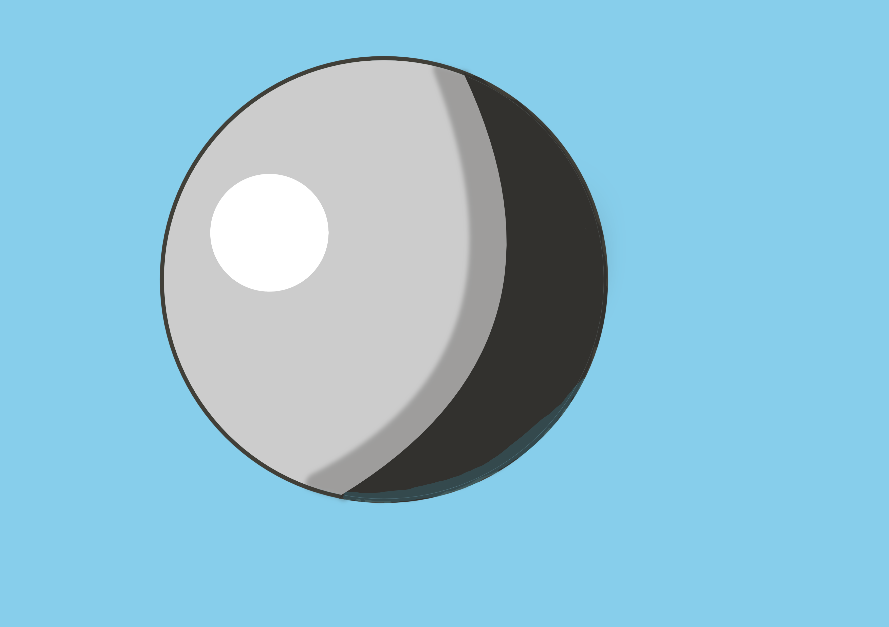

# DAY 3

好的！今天的练习将完全专注于**基础技能巩固**，采用零压力的小元素训练，无需构图或复杂细节。以下是专为你设计的极简版Day3教程——

---

### **🎯 今日主题**  
**《光影魔法球》**  
**训练目标**：掌握基础明暗过渡 × 熟悉图层叠加模式  

---

### **📝 具体步骤**  
#### **模块1：绘制纯色球体（20分钟）**
1. **画个完美圆**：  
   - 在Krita中新建画布（建议800×800像素）  
   - 使用椭圆工具（按住Shift键）画一个正圆  
   - 填充任意纯色（推荐浅灰色 #CCCCCC）  

2. **锁定透明像素**：  
   - 右键点击图层 → 选择 **"Lock Transparency"**（防止涂出圆形）  

---

#### **模块2：二分法光影（30分钟）**
3. **硬边阴影练习**：  
   - 新建图层，命名为"阴影"  
   - 用硬边笔刷（Basic-5 Size）涂黑球的右下半部分  
   - 保持边缘锐利，像月相效果  

4. **模糊过渡实验**：  
   - 复制阴影图层 → 重命名为"过渡"  
   - 对该图层使用 **滤镜 → 模糊 → 高斯模糊**（半径15-20像素）  
   - 调整不透明度至50%  

---

#### **模块3：叠加模式初探（20分钟）**
5. **添加高光**：  
   - 新建图层 → 模式改为 **"叠加"**  
   - 用白色硬边笔刷在左上方点一个圆点  
   - 调整笔刷大小，让高光占球的1/10面积  

6. **环境光模拟**：  
   - 新建图层 → 模式改为 **"柔光"**  
   - 用浅蓝色（#87CEEB）轻涂球体右下边缘  

---

### **🌟 成果标准**  
- **必做项**：  
  ✅ 一个带锐利阴影边界的球体  
  ✅ 一处高斯模糊过渡区域  
  ✅ 至少使用两种图层混合模式  

- **可选加分项**：  
  ⭐ 尝试用正片叠底图层添加投影  
  ⭐ 用涂抹工具柔化阴影边缘  

---

### **🛠️ Krita新手技巧**  
- **快速取色**：按住Alt键点击画布任意位置  
- **撤销历史**：Ctrl+Z最多可回退30步（默认设置）  
- **图层管理**：双击图层重命名，右键分组  

---

### **📌 常见问题预案**  
| 问题                  | 解决方案                                      |  
|-----------------------|---------------------------------------------|  
| **涂色超出圆形**       | 检查是否开启"Lock Transparency"             |  
| **高光不明显**         | 叠加图层改用纯白，或复制高光图层增强效果      |  
| **阴影位置混乱**       | 想象光源在左上方，所有阴影统一在右下区域      |  

---

### **💡 弹性调整方案**  
如果仍感觉吃力，可进一步简化：  
1. **纯二分法版**：仅完成模块1+模块2的硬边阴影  
2. **色块版**：用套索工具直接填充阴影区域  

---

我放弃了，我觉得不带如何目标乱画也挺好的。似乎记起了一些为何我之前这么讨厌画画的原因——实在是太没有天赋了。我身边的人好歹也会一点涂涂画画，我是完全不会。我不知道今天画的是个啥，尝试完全遵循deepseek的指示。这对吗？

还是不会用填充工具。我的区域明明已经圈起来了，然而填充工具仍然会覆盖整片区域，导致一用工具周围都会染上填充的颜色。罢了，人工队永远不会出问题，就是慢了点

也找到了为什么锁定透明度无法使我不涂出区域。阴影图层应该复制，而不是新建。新建后就啥也涂不上去了，因为锁定了。软件我也不会用啊，真的太不会了

高斯模糊被吃了。不知道为什么下面的图层可以覆盖上面的图层，导致上面的图层边缘的高斯模糊效果被吃了。为什么要吃我的高斯模糊？