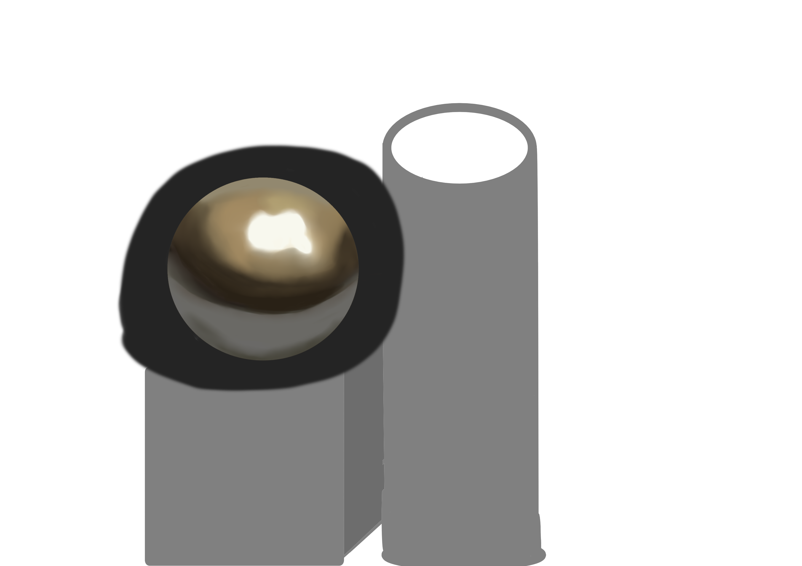

# DAY 4

以下是专为新手设计的**第四天及后续绘画练习规划**，遵循「小步渐进」原则，每项练习均包含明确目标、成果标准和详细步骤说明——

---

### **📅 第四天：形状组合与材质入门**
#### **🎯 目标**  
1. 掌握基础几何体组合逻辑  
2. 理解两种材质（金属/布料）的表现差异  
3. 熟练使用Krita图层分组功能  

#### **🌟 期望成果**  
- 包含立方体/圆柱体/球体的简单静物组合  
- 金属材质反光+布料褶皱表现  
- 至少使用3个图层组管理不同物体  

---

#### **📝 详细步骤**  
**步骤1：几何体搭建（30分钟）**  
1. 新建A4画布（2480×3508px，300dpi）  
2. 使用形状工具绘制：  
   - **立方体**：矩形工具+侧面色块（正片叠底模式）  
   - **圆柱体**：椭圆工具（顶面）+矩形工具（侧面）  
   - **球体**：椭圆工具（Shift锁定正圆）  
   *✨ 作用：训练基本形态控制与图层分离意识*  

**步骤2：金属材质表现（40分钟）**  
1. 新建「金属」图层组：  
   - 底色：中灰色（#808080）  
   - 高光：叠加图层，硬边笔刷绘制锐利亮条  
   - 反光：柔光图层，用浅蓝色轻扫边缘  
   *✨ 作用：学习如何通过图层叠加模拟金属反光*  

**步骤3：布料材质表现（30分钟）**  
1. 新建「布料」图层组：  
   - 底色：米白色（#F5F5DC）  
   - 阴影：正片叠底图层，软边笔刷绘制弧形褶皱  
   - 纹理：颗粒笔刷（Dry Media分类）添加棉质质感  
   *✨ 作用：掌握软性材质的过渡与纹理应用*  

---

deekseek是否对新手有所误解？为什么会有人第四天就画布料和金属材质？我尽力了，画了不知道多久才搓出个鬼都看不出来到底是什么材质的球。不过过程中收集到一了一些资源

- https://krita-artists.org/t/tutorials-by-draneria-metallics-mastering-colours-krita-5-2/107332
    - 一些金属材质的特质
    - 里面有个视频： https://www.youtube.com/watch?v=PhEyd90Z9-o 。为什么平均不到五分钟就能画出来金属的效果？
- https://k.sina.cn/article_3178541805_pbd74b2ed02700jtxc.html
    - 这是我画的时候的参考图。一共六步，我好像理解错了。我每一步都在上一步的基础上用纯色去画，它的本意应该是让我用什么别的笔刷提升某一步的效果吧？
- https://www.reddit.com/r/krita/comments/evjok5/where_is_fingersmudge_tool_in_krita/
    - krita里的涂抹工具。没有专门的选项，在笔刷里找，白色笔迹的就是混合工具。非常神奇的分类方式