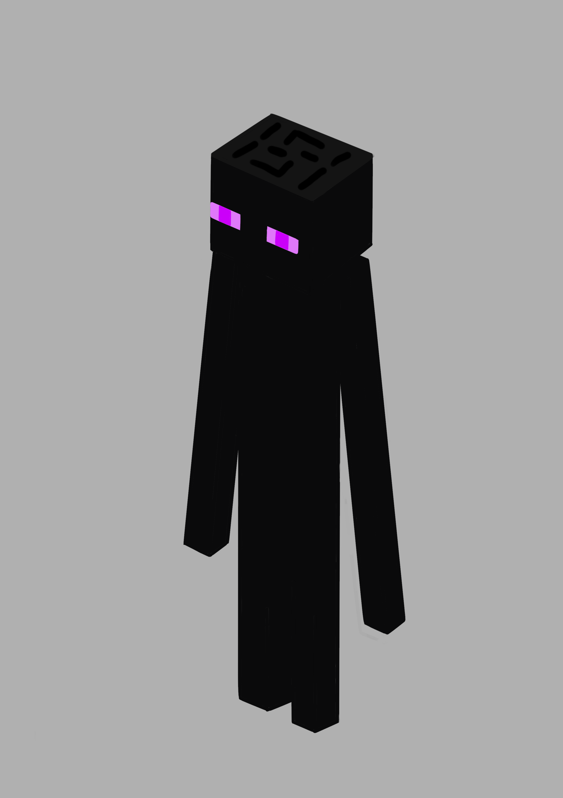

# 末影人

来源： https://zh.minecraft.wiki/w/%E6%9C%AB%E5%BD%B1%E4%BA%BA

- 在主世界生成的所有敌对生物里，末影人是我小时候最喜欢的（骷髅遗憾落败）。虽然它的叫声很难听。
- 细节比恶魂还少，很快就能画完。

画的时候注意到末影人的头是一个长方体。除了头顶的颜色明显比身体淡，手臂和身体的两面都是不同的黑色。一种偏红一种偏蓝。虽然完全看不出来。

画恶魂时没有使用任何辅助工具，导致成品有点歪。这次使用了方格（[grid](https://krita-artists.org/t/how-to-change-grid-size/11099)）。只是好像还是有点歪，而且带着点微妙的错误比例。

