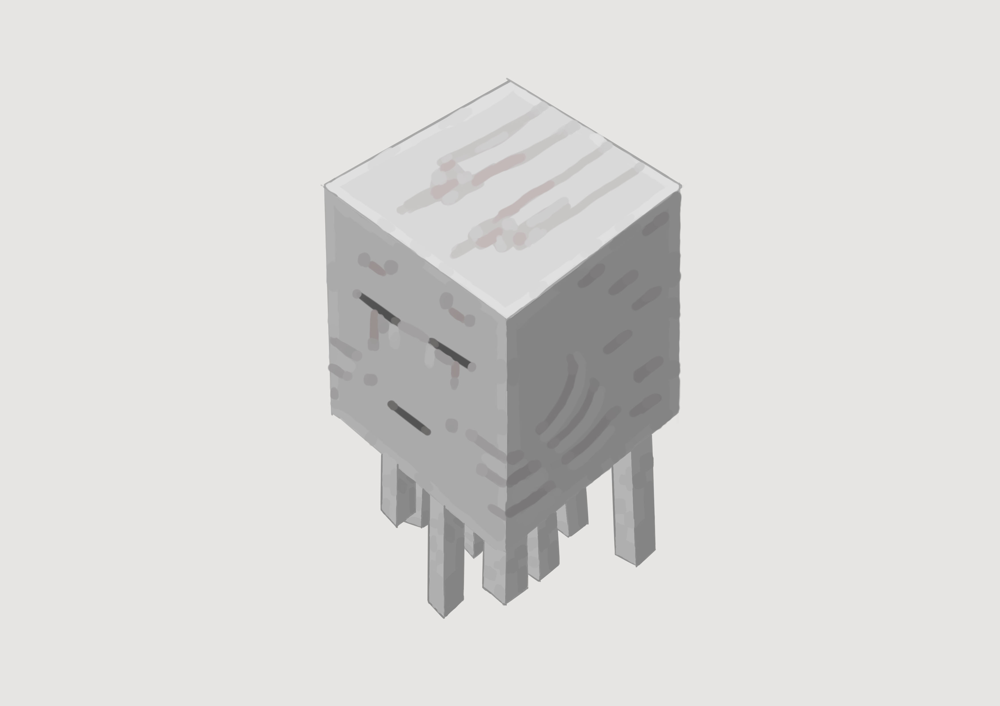

# 恶魂

来源： https://zh.minecraft.wiki/w/%E6%81%B6%E9%AD%82

- 感觉很可爱，虽然实际玩游戏时冷不丁碰见一只恶魂吐火球还是挺烦的。
- 整体没多少细节，非常适合画来玩。

借着这张画弄明白了油漆桶的用法。以前经常遇见油漆桶覆盖太多区域的情况，今天查看了工具选项，调整了“阈值”参数后就没有这种情况了。阈值越低，油漆桶覆盖区域的颜色相似度就越高。不过还是会在线条与颜色的交界处出现白线，今天是手动填满的，下次应尝试调整参数的值。

