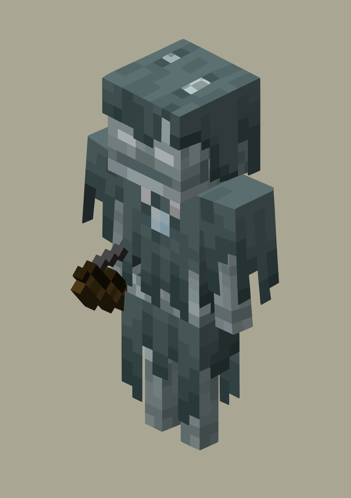

# 流浪者

来源： https://minecraft.wiki/w/Stray

- 搜骷髅的时候搜到了骷髅的变种。感觉比朴素的小白更喜欢一点，但说不上来是哪里更喜欢。我猜是复杂的细节吧。堆细节是极好的。
- 画之前并没有意识到要花多久。

继续用方格纸，并对齐了参考图。这次画的没有那么奇怪了，然而还是有地方不对。虽然看着构造很简单，但是骷髅身上的颜色左一块右一块，画到最后已经麻木了。到最后本以为已经完成了，结果发现还有弓没画。已经不想再画了，故直接描了弓并移到画上去。效果不错。

是时候该画点别的了。我意识到这是一个像素游戏，不适合作为练线条的对象。

